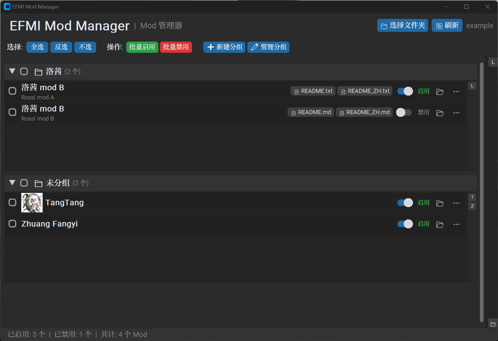
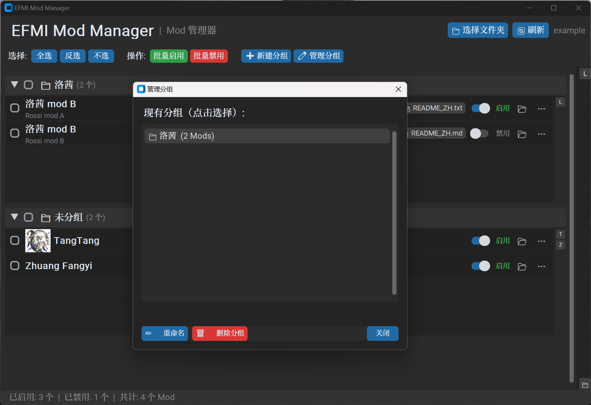
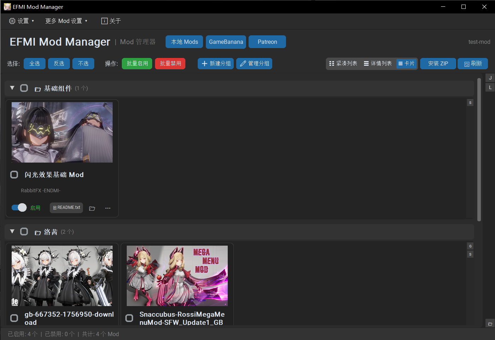

# EFMI Mod Manager

[English](README_EN.md) | **中文**

基于 `customtkinter` 的 Mod 管理器，通过移动文件夹的方式来启用/禁用 Mod。主支持 Windows，兼容 Linux 与 macOS。

> **重要声明**：EFMI Mod Manager 不负责 Mod 的加载、解析或注入。Mod 的加载与运行时逻辑由 EFMI 在游戏启动阶段完成。本程序仅提供一个图形化的前端界面，用于快捷地启用或禁用 Mod —— 其底层实现仅是将 Mod 文件夹在 `Mods`（已启用）与 `Disabled_Mods`（已禁用）目录之间移动，以控制 EFMI 启动时应当加载哪些 Mod。本程序不修改任何 Mod 内容，也不参与 EFMI 的运行时行为。

## 功能特性

- **Mod 管理**：扫描 `Mods` 和 `Disabled_Mods` 文件夹，一键切换启用/禁用
- **批量操作**：支持全选、反选、批量启用、批量禁用
- **分组管理**：可创建、重命名、删除分组，支持折叠/展开分组
- **三视图模式**：本地与在线页均支持紧凑列表 / 详情列表 / 16:9 预览卡片，各页面分别记住上次选择
- **响应式卡片布局**：固定卡片尺寸，窗口放大时自动增加列数，各分组保持统一对齐
- **自定义备注**：为每个 Mod 设置自定义显示名称
- **预览图片**：为每个 Mod 设置预览缩略图，点击可全屏查看原图；缺图时显示占位符；内存 + 磁盘两级缓存，后台加载不卡界面
- **README 检测**：识别中/英/日/韩常见 README 文件名；多个 README 时显示 `README xN` 选择菜单
- **本地 ZIP 安装**：安装前预览压缩包内容、可修改文件夹名、选择安装后启用或禁用、一个 ZIP 可安装多个 Mod
- **GameBanana 在线 Mods**：浏览和搜索 Arknights: Endfield 的 GameBanana Mod（Mods / 工具 / 声音），热门 / 最近更新排序、分页加载、与官网一致的逐级分类筛选；敏感内容默认模糊并二次确认
- **在线安装与更新**：查看详情（简介、作者、版本、截图）、选择文件下载安装；自动记录来源并保存封面为预览图；支持「检查更新」（更新前自动备份、失败自动恢复）与「恢复备份」
- **分类翻译热更新**：内置中/日/韩分类名翻译，「更新分类翻译」按钮可手动拉取最新翻译（未收录分类显示英文原名）
- **AI 翻译**：详情页描述 / Patreon 帖子正文一键翻译（OpenAI 兼容接口，API key 存入系统凭据管理器，不落配置文件）
- **缓存清理**：「设置 → 🧹 清理缓存」按类别统计占用并清理（GameBanana 缓存、Patreon 图片、本地缩略图、浏览器缓存、下载临时残留），不影响登录状态
- **经典菜单栏**：窗口顶部 Win32 风格菜单——「设置」（语言、选择文件夹、清理缓存、AI 翻译设置、网络代理设置）与「更多 Mod 设置」（恢复备份、检查 GameBanana 模组更新），另有独立的「ℹ️ 关于」按钮（项目介绍、免责声明与开源致谢）
- **网络代理设置**：「设置 → 🛰️ 网络代理设置」可手动指定 http/https 代理地址，作用于 GameBanana、Patreon、AI 翻译等所有网络请求以及 Patreon 浏览器；支持「测试连接」与一键重启生效；留空则跟随系统代理
- **深色自定义弹窗**：系统原生提示/确认弹窗全部替换为与界面一致的深色弹窗，不再出现白色系统弹窗
- **Patreon 订阅 Mod**：自动读取已订阅创作者列表（WebView2 浏览器会话，无需额外下载浏览器引擎），浏览付费帖子（最新 / 热门排序、合集、每页 30 篇加载更多），下载 Patreon 附件安装为 Mod；MEGA / Google Drive 等外链在浏览器窗口中手动下载并自动捕获
- **多语言 A-Z 快速跳转**：侧边栏字母索引支持英文、中文拼音首字母（可选依赖 `pypinyin`），混合排序快速定位
- **多语言界面**：自动检测系统语言，支持中文 / English / 日本語 / 한국어 切换
- **DPI 动态缩放**：自适应 Windows 高 DPI 显示器（仅 Windows）
- **暗色主题**：基于 customtkinter 的现代化暗色 UI
- **控制台隐藏**：PyInstaller 打包后默认隐藏终端窗口（仅 Windows；在程序目录创建 `debug_mode` 文件可显示）

## 运行截图







## 目录结构要求

程序需要指向包含以下结构的游戏目录：

```
游戏目录/
├── Mods/                  # 已启用的 Mod（必须存在）
│   ├── ModA/
│   └── ModB/
└── Disabled_Mods/         # 已禁用的 Mod（首次运行自动创建）
    └── ModC/
```

启用/禁用 Mod 的本质是将对应文件夹在 `Mods` 和 `Disabled_Mods` 之间移动。

## 安装与运行

### 方式一：pip（传统方式）

#### 依赖

- Python 3.8+
- customtkinter
- httpx（在线浏览 / Patreon / AI 翻译的 HTTP 客户端）
- Pillow（可选，用于预览图功能）
- pypinyin（可选，用于中文拼音首字母索引）
- pywebview（可选，Patreon 登录/外链下载，Windows 使用系统 WebView2）
- keyring（可选，API key / Patreon cookies 存入系统凭据管理器；不可用时回退文件）

```bash
pip install customtkinter httpx Pillow pypinyin pywebview keyring
```

#### 直接运行

```bash
python mod_manager.py
```

#### 打包为 exe

```bash
pip install pyinstaller
pyinstaller --name "EFMI_Mod_Manager" mod_manager.py
```

- `--windowed` 会隐藏终端窗口
- 如需调试，在 exe 同目录创建名为 `debug_mode` 的空文件即可显示控制台

### 方式二：uv（推荐，更快更轻量）

[uv](https://github.com/astral-sh/uv) 是一个基于 Rust 的高速 Python 包管理器，可直接读取 `pyproject.toml` 配置文件。

#### 安装 uv

```bash
# Windows (PowerShell)
powershell -ExecutionPolicy ByPass -c "irm https://astral.sh/uv/install.ps1 | iex"

# 或使用 pip
pip install uv
```

#### 安装依赖

```bash
# 根据 pyproject.toml 自动同步依赖（推荐）
uv sync

# 或手动安装
uv pip install customtkinter httpx Pillow pypinyin pywebview keyring
```

#### 直接运行

```bash
# 在 uv 管理的虚拟环境中运行
uv run python mod_manager.py
```

#### 打包为 exe

```bash
# 安装开发依赖（含 pyinstaller）
uv sync --group dev

# 使用 uv 环境中的 pyinstaller 打包
uv run pyinstaller --name "EFMI_Mod_Manager" mod_manager.py
```

- `--windowed` 会隐藏终端窗口
- 如需调试，在 exe 同目录创建名为 `debug_mode` 的空文件即可显示控制台

## 使用说明

### 1. 选择游戏目录

点击顶部 **📁 选择文件夹**，选择包含 `Mods` 文件夹的游戏根目录。程序会自动检测并在需要时创建 `Disabled_Mods` 文件夹。

### 2. 管理 Mod

- **切换视图**：使用工具栏右侧的 **☷ 紧凑列表 / ☰ 详情列表 / ▦ 卡片** 按钮切换显示方式，本地与在线页分别记住上次选择
- **启用/禁用单个 Mod**：点击 Mod 行或卡片中的开关按钮
- **批量操作**：勾选 Mod 前的复选框（或使用分组复选框全选该组），点击 **批量启用** 或 **批量禁用**
- **卡片布局**：卡片保持固定尺寸，窗口变宽时自动增加列数；每个分组整体居中，卡片从左侧依次排列
- **安装 ZIP**：点击 **安装 ZIP** 选择压缩包，确认候选 Mod、目标文件夹名与启用/禁用状态后安装（安装前会做安全预检：危险路径、压缩炸弹、非法文件名等）
- **菜单栏**：窗口最顶部「设置」菜单（语言 / 选择文件夹 / 🧹 清理缓存 / 🌐 AI 翻译设置 / 🛰️ 网络代理设置）与「更多 Mod 设置」菜单（恢复备份 / 检查 GameBanana 模组更新），右侧为独立的「ℹ️ 关于」按钮；「📁 选择文件夹」按钮在选好路径后自动隐藏

### 3. 分组管理

- **新建分组**：工具栏点击 **➕ 新建分组**
- **管理分组**：工具栏点击 **✏️ 管理分组**，可新建、重命名或删除分组，对话框保持打开支持连续操作
- **添加 Mod 到分组**：点击 Mod 行右侧的 **⋯** 按钮 → **📁 添加到分组 / 移出分组**
- **折叠分组**：点击分组标题栏左侧的箭头按钮

### 4. 更多操作

点击 Mod 行右侧的 **⋯** 按钮：

| 操作 | 说明 |
|------|------|
| 📝 编辑备注 | 设置 Mod 的显示名称（替代原文件夹名） |
| 🖼️ 设置预览图 | 选择图片作为 Mod 缩略图 |
| 📁 分组操作 | 将 Mod 加入或移出分组 |
| 🗑️ 清除备注/预览图 | 移除已设置的备注或预览图 |

README 文件会显示在 Mod 的操作区，三种视图统一采用聚合规则：没有 README 不显示按钮；只有一个时直接打开；有多个时显示 **📄 README xN**，点击后从菜单中选择文件。支持 `.md` / `.txt` 以及 `ZH`、`CN`、`CHS`、`TW`、`EN`、`JA`、`JP`、`KO`、`KR` 等常见语言后缀。

### 5. GameBanana 在线 Mods

顶部切换到 **GameBanana** 页面，可浏览和搜索 Arknights: Endfield 的在线 Mod：

- **分类筛选**：与 GameBanana 官网一致的逐级分类（Mods / 工具 / 声音），按所选分类搜索、排序、加载更多；新分类无需更新软件即可使用
- **排序与分页**：🕐 热门 / 最近更新排序切换，底部「加载更多」继续加载
- **三视图**：☷ 紧凑列表 / ☰ 详情列表 / ▦ 卡片（选择自动保存）
- **敏感内容**：默认开启「隐藏敏感内容」开关——敏感 Mod 缩略图模糊、查看详情前再次确认；关闭后直接显示原图（标题上的敏感标记保留）
- **详情与安装**：点击条目打开详情（封面、简介、作者、版本、截图、当前文件/归档文件），选择具体文件下载安装；安装后自动记录来源并保存封面为本地预览图（已有预览不覆盖）
- **分类翻译**：点击「更新分类翻译」可手动拉取最新分类名翻译（未收录的分类显示英文原名；仅点击时联网，断网或失败时使用随包内置翻译）
- **AI 翻译**：详情页点击 **🌐 翻译** 可将描述翻译为界面语言（需先在「设置 → AI 翻译设置」中配置 Base URL、API Key 与模型）
- **更新与备份**：顶栏「更多 Mod 设置 → 检查 GameBanana 模组更新」检查已安装在线 Mod 的新版本（更新前自动备份、失败自动恢复）；「恢复备份」回到最近一次更新前版本

### 6. 清理缓存、AI 翻译设置与网络代理

- **🧹 清理缓存**（设置菜单）：勾选要清理的项目并查看占用空间——GameBanana 缓存、Patreon 图片缓存、本地缩略图、Patreon 浏览器缓存、下载临时残留；浏览器缓存清理不影响登录状态
- **🌐 AI 翻译设置**（设置菜单）：填写 OpenAI 兼容服务的 Base URL、API Key 与模型（可用「获取可用模型」自动列出）；API key 存入系统凭据管理器，不写入配置文件
- **🛰️ 网络代理设置**（设置菜单）：手动指定 http/https 代理地址（可点「测试连接」验证），作用于全部网络请求与 Patreon 浏览器；保存后提示重启生效，可一键立即重启；留空则跟随系统代理

### 7. 快速跳转

右侧 A-Z 侧边栏采用两级索引：

- **一级索引（全局）**：按分组名首字母列出 A-Z 按钮，点击跳转到对应分组标题。底部有未分组专用按钮。
- **二级迷你索引（组内）**：每个分组内容区右侧嵌入该组的迷你 A-Z 栏，只显示组内 Mod 实际存在的首字母，点击跳转到组内对应 Mod。多组迷你索引同时可见，互不干扰。

安装 `pypinyin` 后，中文名称会按拼音首字母参与混合排序和索引（例如"中文分组"出现在"Z"下），未安装则按原始字符排序。

### 8. Patreon 订阅 Mod

顶部切换到 **Patreon** 页面，可浏览你关注/订阅创作者的帖子（付费 + 公开）：

- **登录**：首次使用点击 **登录 Patreon**，程序会临时打开浏览器窗口（基于 Windows 自带的 WebView2/Edge 内核）完成登录并保存会话；**日常浏览（帖子列表、详情、附件下载）全部通过 httpx 直连 API，不占用浏览器进程，内存开销极低**；浏览器仅在登录、刷新订阅、外链下载时短暂启动，用后自动关闭
- **订阅列表**：点击 **🔄 刷新订阅** 读取账号关注的所有创作者（临时启动浏览器抓取，完成后自动关闭）；顶部输入框可按名称筛选
- **合集（分类入口）**：选中创作者后，左侧列表下方动态显示该创作者的 **📁 合集**（每个作者的合集不同，按创作者动态加载）；点击合集浏览其中帖子，**🗂 全部帖子** 恢复完整列表（合集帖子一次加载，无分页）
- **帖子视图**：右侧帖子列表支持与 GameBanana 页一致的 **☷ 紧凑 / ☰ 详情 / ▦ 卡片** 三种显示形式（选择会自动保存），并有 **🕐 最新 / 🔥 热门** 排序切换（热门按点赞数排序，对应作者首页的两个入口）；**每页 30 篇，底部「加载更多」按钮继续加载，顶部显示"显示 X / Y 篇"**；列表只加载标题、日期、付费标记与封面小图（正文/附件按需加载，浏览速度快）
- **帖子详情**：点击帖子（或 **📄 详情** 按钮）打开详情对话框，包含封面大图、**正文全文与帖子内图片（图文混排，点击图片可全屏查看）**、附件列表与外部下载链接，均在打开时按需加载（已打开过的帖子走缓存）
- **下载附件**：详情页 **下载并安装**，程序下载 Patreon 托管附件并走标准安装流程（ZIP 可选择候选，单文件自动建独立 Mod 文件夹）；未订阅的付费帖会显示 **🔒 需订阅** 标记
- **外链**：部分作者将文件放在 MEGA / Google Drive 等外部站点，详情页 **打开并捕获** 会打开浏览器窗口，请在窗口中手动完成下载，完成后文件会被自动捕获并询问是否安装；也可点 **复制** 复制链接

> 注意：Patreon 功能仅用于下载你本人已订阅的内容，请遵守各创作者的授权条款。外链站点（MEGA、Google Drive 等）的登录状态需要你在浏览器窗口中自行登录一次。

## 配置文件

程序配置保存在 `mod_manager_config.json`（与程序同目录），包含：

- `language`：语言设置（`"auto"`, `"zh"`, `"en"`, `"ja"`, `"ko"`）
- `view_modes`：各页面显示模式（`local` / `online` / `patreon`，值为 `"compact"` / `"card"` / `"detailed"`；旧 `view_mode=list/card` 自动迁移）
- `game_path`：游戏目录路径
- `mod_notes`：Mod 备注名称
- `mod_images`：Mod 预览图路径（Mod 文件夹内的图片存相对路径，外部图片存绝对路径）
- `mod_groups`：分组数据
- `group_order`：分组排序
- `collapsed_groups`：已折叠的分组列表
- `hide_sensitive_content`：在线页「隐藏敏感内容」开关（默认 `true`）
- `installed_sources`：在线安装 Mod 的来源记录（GameBanana / Patreon 的 ID、MD5、路径等）
- `patreon_creators` / `patreon_hidden_creators` / `patreon_hide_unentitled`：Patreon 创作者列表与显示设置
- `ai_base_url` / `ai_model`：AI 翻译服务地址与模型（API key 存系统凭据管理器，不写入配置文件；keyring 不可用时回退到 `ai_api_key` 字段）
- `proxy`：全局网络代理地址（http/https，留空则跟随系统代理）
- `gb_category_i18n_url`：分类翻译热更新 URL（可选覆盖）

其他数据目录（`data/`）：`cache/`（API 缓存与缩略图）、`downloads/`（下载暂存）、`staging/`（安装暂存）、`backups/`（更新备份）、`patreon_profile/`（WebView2 用户数据）。

## 代码结构

项目采用模块化架构，核心代码拆分到 `modules/` 包中：

```
mod_manager.py              ← 入口文件，启动初始化
modules/
├── __init__.py             ← 包声明
├── config.py               ← 配置管理（JSON 读写、分组、备注、预览图、data/ 目录）
├── mod_ops.py              ← 本地 Mod 操作（扫描、移动、验证、README 检测）
├── i18n.py                 ← 多语言（系统语言检测、JSON 翻译加载）
├── console_setup.py        ← 控制台/警告管理（stderr 重定向、pkg_resources 警告抑制）
├── catalog_view.py         ← 视图状态（三视图模式、页面选择/分页状态、README 0/1/N 规则）
├── local_preview_cache.py  ← 本地预览图两级缓存（内存 LRU + 磁盘缩略图）
├── gamebanana.py           ← GameBanana API 客户端（浏览/分类/详情/安全下载）
├── gb_category_i18n.py     ← 分类名翻译（内置 + 缓存 + GitHub 手动热更新）
├── ai_translate.py         ← AI 翻译（OpenAI 兼容接口，keyring 存 key）
├── archive_installer.py    ← ZIP 安全安装 / 单文件安装（预检、事务安装）
├── source_store.py         ← 在线源安装记录（installed_sources + .efmi_mod_manager/source.json + 封面保存）
├── update_checker.py       ← 保守的 GameBanana 更新匹配
├── update_manager.py       ← 事务更新 / 备份恢复（原子替换、失败自动回滚）
├── cleanup.py              ← 缓存清理（按类别统计占用与清理，不影响登录态）
├── gui.py                  ← GUI 主界面（本地页 + 菜单栏、事件处理、批量操作）
├── online_browser.py       ← GameBanana 在线浏览页（分类筛选、三视图、详情安装）
├── patreon.py              ← Patreon 客户端（httpx 直连 + WebView2 登录/抓取/下载捕获）
├── patreon_browser.py      ← Patreon 订阅浏览页（创作者列表、帖子、下载/外链）
└── dialogs.py              ← 自定义对话框（深色样式，替代系统原生 messagebox）

locales/
├── en.json                 ← 英语翻译文件
├── ja.json                 ← 日语翻译文件
├── ko.json                 ← 韩语翻译文件
└── category_translations/  ← GameBanana 分类名翻译（gb_category_names.json）
```

**模块调用链：**  
`mod_manager.py` → `console_setup.py` + `i18n.py`（启动阶段）  
`mod_manager.py` → `gui.py` → `config.py` + `mod_ops.py`

详细文档见 [中文模块文档](modules/modules.md) / [English Modules Documentation](modules/modules_EN.md)。

## 技术栈

- **语言**：Python 3
- **GUI 框架**：[customtkinter](https://github.com/TomSchimansky/CustomTkinter)
- **图片处理**：Pillow (PIL)
- **HTTP**：httpx
- **凭据存储**：keyring（Windows 凭据管理器）
- **Patreon 浏览器会话**：[pywebview](https://github.com/r0x0r/pywebview)（Windows 10/11 使用系统自带 WebView2，无需下载浏览器引擎；Linux 需系统 WebKitGTK）
- **打包工具**：PyInstaller

## 许可证

This project is open source and available under the [GPLv3 License](https://github.com/gunfub/EFMI_Mod_Manager/blob/main/LICENSE).
